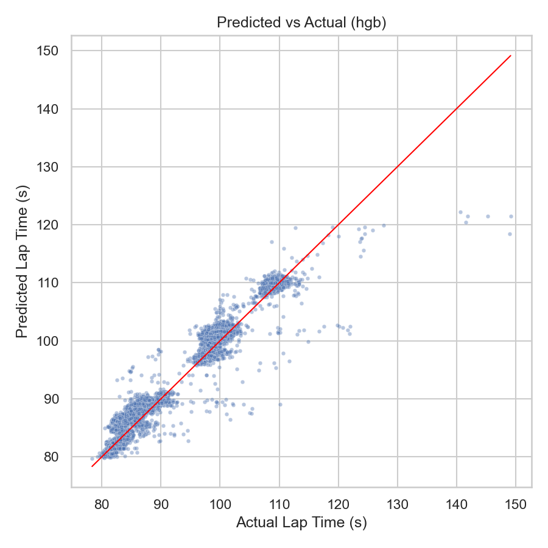
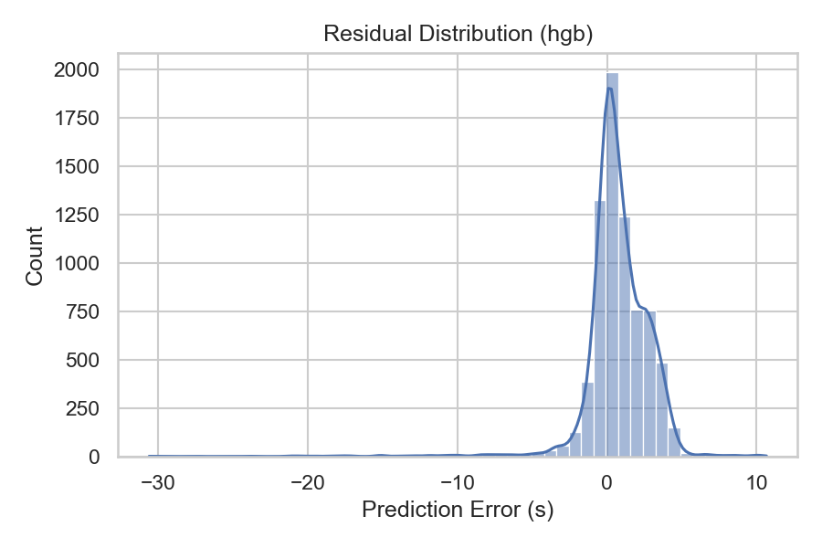
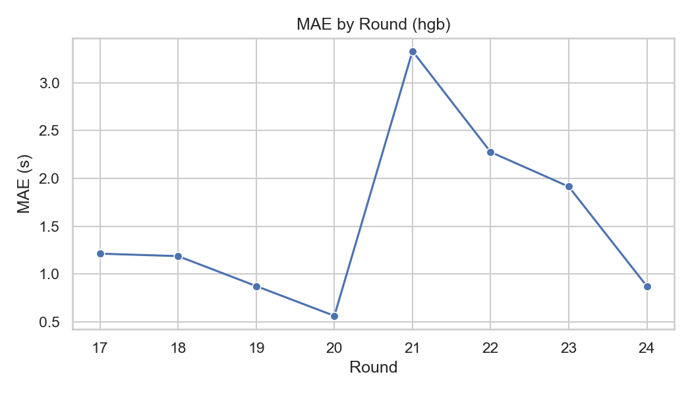
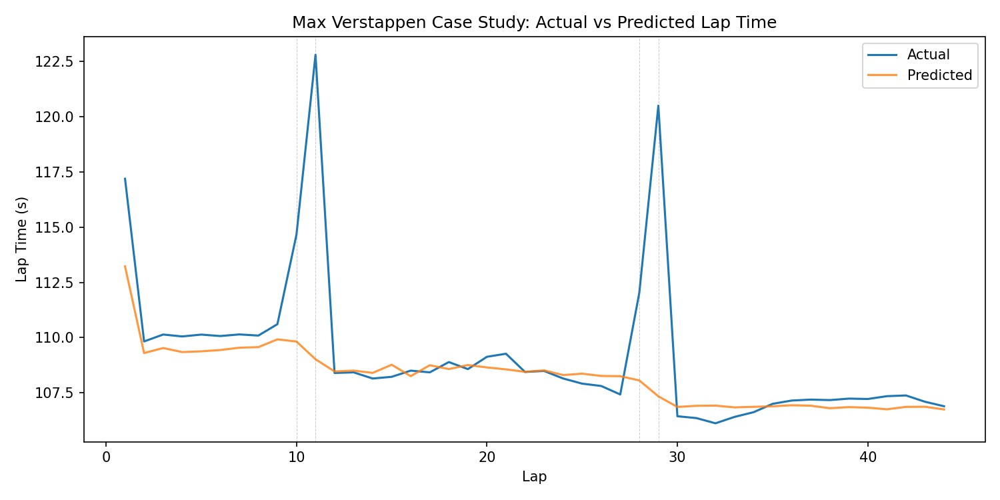

# F1 2024 Pit Strategy ML + Simulation

[](https://your-app-name.streamlit.app) *(Update with your Streamlit Cloud URL)*

This project builds a lap-time prediction model from **F1 2024 main race data** and uses it to simulate pit strategies.

## Goals
- Predict lap time with ML (baseline linear + tree model)
- Simulate alternative pit strategies and compare total race time
- Produce a clear report and resume-ready results

## Structure
- `data/raw/` : raw session exports per race
- `data/features/` : cleaned feature dataset
- `data/models/` : trained model artifacts
- `data/metrics/` : evaluation metrics
- `reports/` : short summary write-up
- `figures/` : plots
- `src/` : data + model + simulation code
- `app.py` : Streamlit web application

## Setup
```bash
python -m venv .venv
source .venv/bin/activate
pip install -r requirements.txt
```

## Quickstart

### Command Line Pipeline (2024 main races)
1. Pull raw data (per race)
```bash
python src/data/pull_2024_races.py --cache-dir cache
```

2. Build feature dataset
```bash
python src/features/build_features.py
```

3. Train models and evaluate
```bash
python src/models/train_models.py --train-rounds 1-16 --test-rounds 17-24
```
Note: training excludes pit-laps and safety-car laps by default. Use `--include-pit-laps` or `--include-safety-cars` to override.

4. Estimate pit-loss distributions (per race)
```bash
python src/sim/compute_pit_loss.py
```

5. Evaluate + diagnostics
```bash
python src/models/evaluate.py --rolling
python src/plots/make_plots.py --model hgb
```

6. Simulate strategies (example)
```bash
python src/sim/strategy_sim.py --round 14 --driver VER --pit-loss auto
```

7. Case study report (Max Verstappen)
```bash
python src/reports/case_study_max.py --round 14 --driver VER --model hgb
```

## Web App (Streamlit)

**🚀 [Try the Interactive App →](https://your-app-name.streamlit.app)** *(Update with your Streamlit Cloud URL)*

Or run locally:
```bash
streamlit run app.py
```

The interactive web app provides:
- **Round/Driver Selection**: Pick any 2024 race and driver
- **Model Choice**: Compare Ridge vs HistGradientBoosting predictions
- **Monte Carlo Simulation**: Run 1-2000 simulations per strategy with realistic noise
- **Strategy Comparison**: View top strategies ranked by total race time with uncertainty bands
- **Pit Loss Modeling**: Auto-loads race-specific pit-loss distributions
- **Residual Noise**: Optionally uses model residuals for realistic lap-time variation
- **Visualizations**: Interactive bar charts (Altair) showing strategy comparisons
- **Export**: Download results as CSV

**Note**: The app requires pre-trained models and pre-computed metrics. Run the full pipeline (steps 1-5) before using the app.

## Results (2024 test rounds 17–24)
- HGB MAE: **1.49s**, RMSE: **2.30s**
- Ridge MAE: **3.74s**, RMSE: **4.91s**
- Target: `LapTimeDelta` (lap time minus race median) for track normalization

## Sample Plots




## Case Study (Max Verstappen, Round 14)
- Report: `reports/case_study_max_round14.md`


## Week Plan (1-week sprint)
1. Data pull + cleaning for all 2024 races
2. Feature engineering and baseline model
3. Tree model + evaluation
4. Strategy simulation
5. Report + plots

## Notes
- FastF1 supports 2018+ timing data; 2024 is fully supported.
- We only use main race sessions (`"R"`).
- Models train on `LapTimeDelta` (lap time minus race median) to normalize track-to-track pace.

## Deliverables
- `reports/summary.md` with metrics + findings
- `figures/` with plots (lap-time error, feature importance, strategy comparison)
- `data/metrics/metrics.json`
- Interactive Streamlit web app for strategy simulation

## Deployment

### Streamlit Cloud
1. Push this repo to GitHub
2. Go to [share.streamlit.io](https://share.streamlit.io)
3. Connect your GitHub repo
4. Set main file to `app.py`
5. Deploy!

The app will automatically use the pre-trained models and metrics from the `data/` directory.
