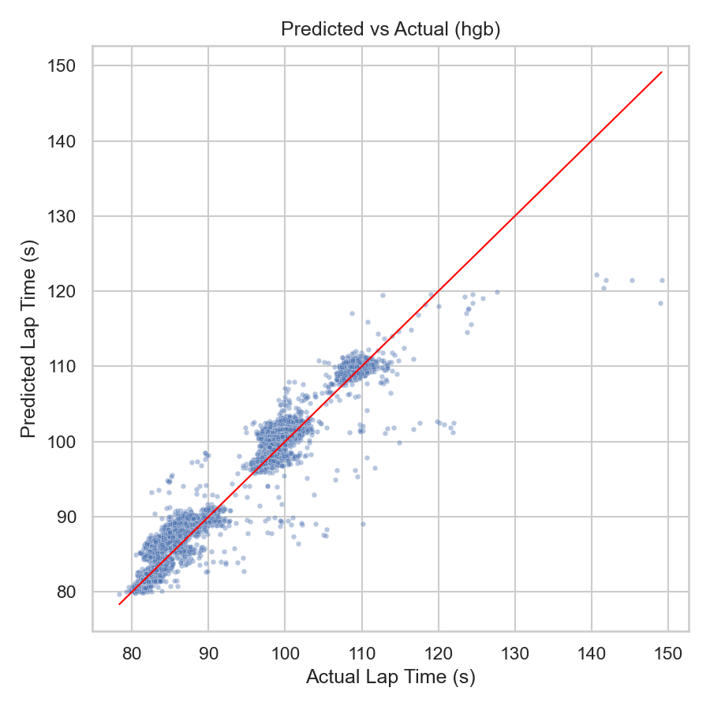
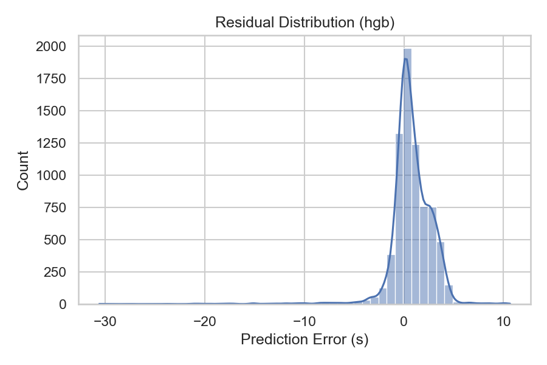
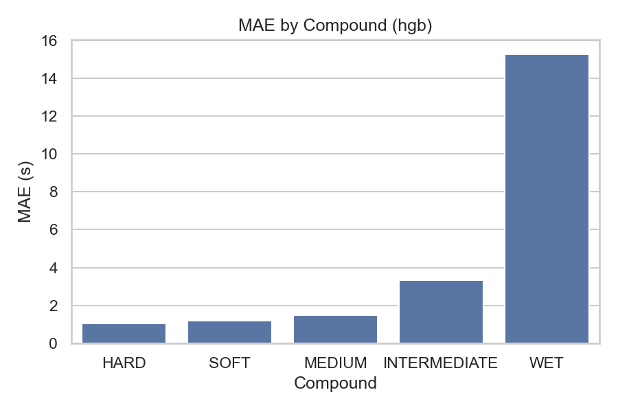
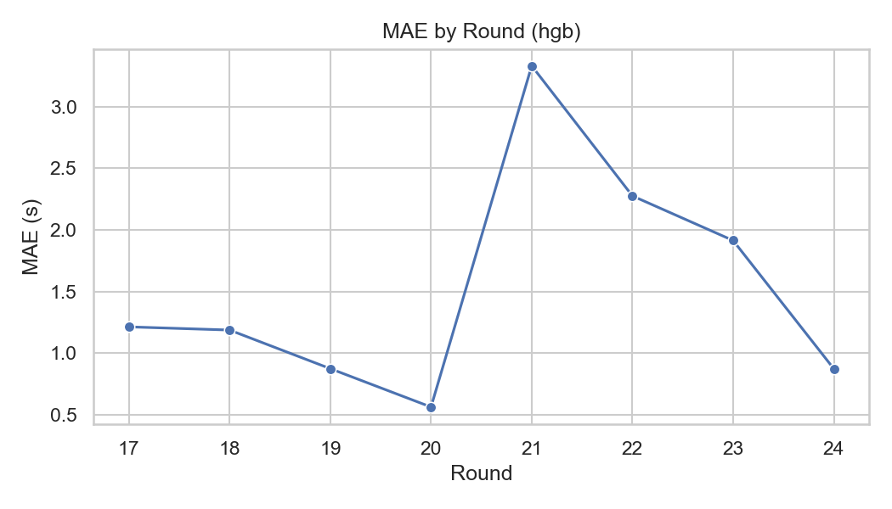
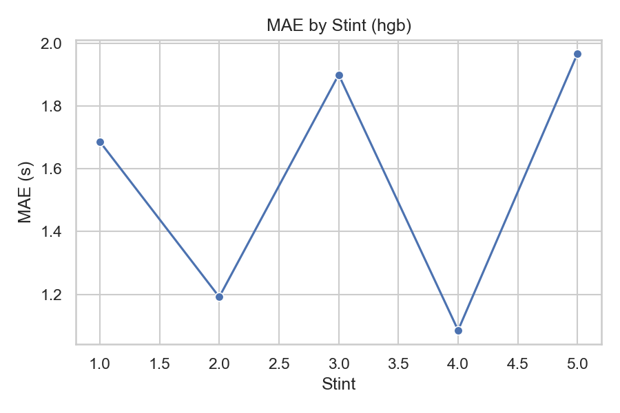

# 🏎️ F1 Race Strategy Decision Support System

> **Lap-time prediction + Monte Carlo strategy optimization for Formula 1 — built on real 2021-2025 race data.**

[](https://www.python.org/)
[](https://streamlit.io)
[](https://scikit-learn.org/)
[](LICENSE)

This project is an interactive decision-support application that helps evaluate Formula 1 pit-stop strategies using historical race telemetry, machine learning, and Monte Carlo simulation. Users can compare multiple strategies, estimate total race time, and analyze uncertainty through an interactive Streamlit dashboard.

Live app: [https://f1-predictor-temp.streamlit.app/](https://f1-predictor-temp.streamlit.app/)

---

## 📸 Screenshots


---

## ❓ Problem Statement

A Formula 1 race strategy engineer must decide:

- **When** to pit (which lap)
- **Which tyre compound** to fit next (Soft / Medium / Hard)
- **How many stops** to make in total

Getting this wrong costs seconds — sometimes entire race positions. The challenge is that the right answer depends on dozens of factors at once: how quickly a particular tyre degrades over a stint, the ambient and track temperature on race day, how long a pit stop costs at a specific circuit, and how all of these factors interact across 40–70 laps.

**Data helps** because historical lap times encode tyre degradation curves, track-specific pace differentials between compounds, and pit-stop time costs. A model trained on this data can predict how fast each lap will be under any hypothetical strategy — far faster than a human can reason through every combination by hand.

---

## 💡 Why this project?

Modern Formula 1 strategy decisions depend on balancing tyre degradation, weather, pit-stop costs, and race conditions. Evaluating every possible combination manually is impractical. This project demonstrates how machine learning and simulation can support engineers by narrowing down promising strategies quickly while providing confidence estimates rather than single predictions.

---

## ✨ Features

| Category | Feature |
|---|---|
| 🎮 **Interactive Strategy Simulator** | Compare strategies, view confidence intervals, and explore optimal pit windows |
| 📊 **Race Dashboard** | View live telemetry, model metrics, and season-at-a-glance stats |
| 📈 **Feature Importance** | Interactive permutation importance graph to explain which features influence predictions most |
| ✏️ **Custom Strategy Input** | Test any user-defined pit plan (e.g. `SOFT:18,MEDIUM:22,HARD:20`) |
| 🎲 **Monte Carlo Simulation** | Up to 2,000 simulations per strategy with residual-based lap noise and pit loss sampling. [Read more](docs/MONTE_CARLO.md) |
| 🧠 **Machine Learning Prediction** | Dual-model training (Ridge + HistGradientBoosting) with rolling train/test splits. [Read more](docs/ML_PIPELINE.md) |
| 🔬 **Feature Engineering** | Prior-season circuit baseline, lap-time delta target, safety-car flags, pit-lap flags, and weather features |
| 📥 **CSV Export** | Download Monte Carlo simulation results as CSV |
| 🧭 **Explainability** | Model Performance tab now includes rolling MAE, compound/round diagnostics, and feature importance artifacts |

---

## 🛠️ Tech Stack

| Category | Technology |
|---|---|
| **Programming** | Python |
| **UI** | Streamlit, Custom CSS (glassmorphism), HTML5 Canvas Animations |
| **Machine Learning** | Scikit-learn (`Ridge`, `HistGradientBoostingRegressor`) |
| **Data Processing** | Pandas, NumPy |
| **Visualization** | Altair, Matplotlib, Seaborn |
| **Utilities** | Joblib, FastF1, PyArrow |

---

## 📐 Design Decisions

| Decision | Reason |
|---|---|
| **HistGradientBoosting** | Better performance on nonlinear tabular data compared to standard regressors |
| **Ridge Regression** | Baseline for comparison |
| **Monte Carlo** | Outcome distributions plus conservative risk-adjusted strategy ranking |
| **Streamlit** | Rapid interactive prototyping and deployment |
| **Parquet** | Faster loading and smaller storage than CSV |

---

## 🚀 Quick Start

For detailed project structure and advanced usage, see the [Project Structure Docs](docs/PROJECT_STRUCTURE.md).

```bash
# 1. Clone the repository
git clone https://github.com/<your-username>/f1-pit-strategy-ml.git
cd f1-pit-strategy-ml

# 2. Create and activate a virtual environment
python -m venv .venv
source .venv/bin/activate

# 3. Install dependencies
pip install -r requirements.txt

# 4. Launch the app (pre-built data included)
streamlit run app.py
```

---

## 📈 Results

Models are trained on **Rounds 1–16** (Bahrain → Italy) and evaluated on **Rounds 17–24** (Azerbaijan → Abu Dhabi) — races the model has never seen during training.

### Overall Performance

| Model | MAE (s) | RMSE (s) |
|---|---|---|
| **HGB (HistGradientBoosting)** | **1.75** | **2.80** |
| Ridge Regression | 3.17 | 3.98 |

_MAE and RMSE measure error relative to the true absolute lap time._

These results use a leakage-free `PreRaceBaseline`: the latest available earlier-season median for the same circuit. The completed test race is never used to reconstruct its absolute lap times. This is deliberately harder—and more representative—than evaluation against the completed race's own median.

### Latest Evaluation Artifacts

- `data/metrics/metrics.json` and `data/metrics/metrics_2024.json` store the latest split-wide metrics used by the app
- `data/metrics/feature_importance_hgb.csv` stores permutation feature importance for HGB
- `data/metrics/rolling_metrics_hgb.json` and `data/metrics/rolling_metrics_ridge.json` store rolling validation results
- `data/metrics/predictions_hgb.parquet` and `data/metrics/predictions_ridge.parquet` store per-lap predictions and residuals used by Monte Carlo noise sampling
- `data/metrics/strategy_support_2024.json` stores prior-season tyre-life support limits used to penalize weak counterfactuals

### Case Study — Max Verstappen, Round 14 (Belgian GP)

In the Belgian GP retrospective case study, the conservative score recommends a supported two-stop Medium → Hard → Hard strategy. Round 14 is part of the training window, so this is a product demonstration rather than holdout validation.

### Current App Behavior

- Streamlit dashboard with separate `Dashboard`, `Strategy Simulator`, and `Model Performance` tabs
- Sidebar tooltips for each simulation control
- Monte Carlo outputs mean and P10/P50/P90 strategy time bands when multiple simulations are enabled
- Conservative ranking combines expected time, upper-tail uncertainty, and penalties for tyre life beyond historical support

## 📊 Generated Evaluation Plots

The training and evaluation workflow produces static plots for model diagnostics and strategy analysis. These can be regenerated with:

```bash
python src/plots/make_plots.py --model hgb
```











## ⚠️ Known Limitations

- Wet-weather laps show much higher MAE than dry-weather laps. The model is much more reliable for dry-race strategy decisions than for wet-race calls without a dedicated wet-weather model.
- The 2024 Chinese GP is not exposed in the app because no 2021–2023 race exists from which to construct a leakage-free circuit baseline.
- The simulator still relies on historical lap-time patterns and sampled residuals, so it does not explicitly model live traffic, safety-car timing, or overtakes.
- Historical-support penalties reduce unsafe extrapolation but do not turn observational race data into a fully causal model.

---

## 📚 What I Learned

- Designing maintainable Streamlit applications
- Building reproducible ML pipelines
- Separating UI from business logic
- Feature engineering for time-series datasets
- Simulating uncertainty using Monte Carlo methods
- Organizing reusable Python modules

---

## 📜 License

MIT — see [LICENSE](LICENSE) for details.
