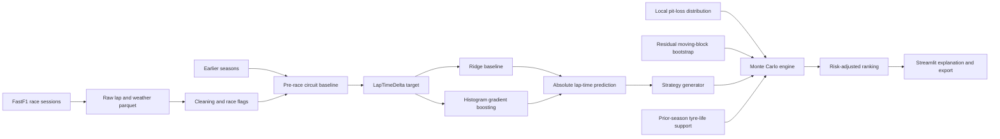
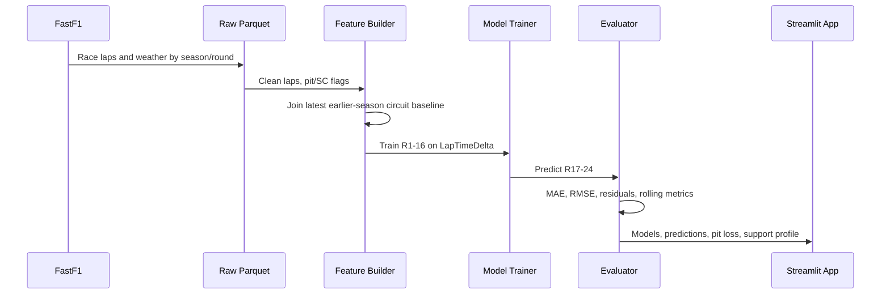
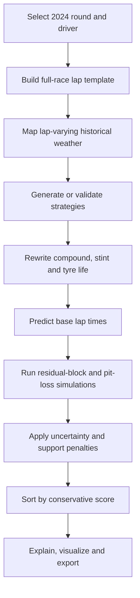

# F1 Strategy Simulator: Interview Architecture and Mathematics

## Executive Summary

This project is a retrospective Formula 1 strategy decision-support system. It uses historical FastF1 race laps to estimate clean-race lap pace, constructs alternative tyre strategies, models pit-stop and lap-time uncertainty, and ranks strategies with a conservative risk score.

The system is deliberately positioned as a historical scenario simulator—not a live race engineer and not a fully causal optimizer. Its strongest use case is answering:

> Given a known historical race context, which supported one-stop or two-stop strategy has the best risk-adjusted simulated race time?

The deployed application is restricted to the 2024 model and artifacts. The model is trained on Rounds 1–16 and evaluated on unseen Rounds 17–24.

## Concept Graph



## System Boundaries

### What the system does

- Predicts normalized clean-lap pace for a driver, circuit context, compound and tyre age.
- Enumerates valid one-stop and two-stop strategies.
- Rejects malformed strategies and enforces race-distance, stint-length and compound constraints.
- Samples correlated model errors and race-specific pit loss.
- Penalizes tyre-life combinations beyond prior-season historical support.
- Reports expected time, P10/P50/P90 outcomes and a conservative ranking score.

### What the system does not do

- Predict live traffic, overtakes, undercut position or pit-lane release gaps.
- Forecast safety-car, VSC or red-flag timing.
- Establish the true causal outcome of a strategy that was never run.
- Treat its P10–P90 outcome interval as a formal confidence interval.
- Generalize the 2024 deployed model to another season without retraining.

## Repository Structure

| Area | Responsibility |
|---|---|
| `src/data/` | Download FastF1 race laps and weather |
| `src/features/` | Clean laps and construct leakage-free baseline targets |
| `src/models/` | Train, evaluate and test generalization |
| `src/sim/strategies.py` | Parse, validate and enumerate strategies |
| `src/sim/uncertainty.py` | Load residuals and sample moving blocks |
| `src/sim/support.py` | Construct and evaluate tyre-life support limits |
| `src/sim/compute_pit_loss.py` | Estimate local pit-stop loss distributions |
| `src/sim/strategy_sim.py` | Command-line simulation interface |
| `app.py` | Streamlit orchestration and simulation presentation |
| `ui_helpers.py` | Tables, charts, explanations and result formatting |
| `data/` | Versioned features, models and evaluation artifacts |
| `tests/` | Model-artifact, feature, strategy and simulation regressions |

## Offline Data Pipeline



### Reproducible command order

The first season is a history seed only; it has no earlier season in the repository and must not be used as a leakage-free training target.

```bash
# Download race sessions
python src/data/pull_2024_races.py --season 2021
python src/data/pull_2024_races.py --season 2022
python src/data/pull_2024_races.py --season 2023
python src/data/pull_2024_races.py --season 2024

# Build the history seed, then leakage-free target seasons in chronological order
python src/features/build_features.py --season 2021 --allow-missing-baseline-history
python src/features/build_features.py --season 2022
python src/features/build_features.py --season 2023
python src/features/build_features.py --season 2024

# Train and produce simulation artifacts
python src/models/train_models.py --season 2024
python src/models/evaluate.py --season 2024 --rolling
python src/sim/compute_pit_loss.py --season 2024
python src/sim/support.py --season 2024
python src/plots/make_plots.py --model hgb

# Verify and run
python -m pytest -q
streamlit run app.py
```

## Feature and Target Mathematics

### Clean-lap set

Let `L` be an observed lap time. Training excludes deleted laps, pit-in/pit-out laps and safety-car laps. This prevents pit delay and neutralized pace from being learned as normal tyre degradation.

### Pre-race baseline

For event `e` in target season `t`, the baseline is the clean-lap median from the latest available prior season at the same event:

```math
B_{e,t} = \operatorname{median}\{L_i : Event_i=e, Season_i=\max(Season < t), Clean_i=1\}
```

The target is:

```math
y_i = L_i - B_{e,t}
```

This avoids using the completed target race as its own absolute-time anchor. If no earlier-season event exists, the race is not exposed by the deployed app.

### Model prediction

The model learns:

```math
\hat{y}_i = f(X_i)
```

where `X` includes driver, team, event, compound, lap number, stint, tyre life, track status and weather. Absolute lap time is reconstructed as:

```math
\hat{L}_i = B_{e,t} + \hat{y}_i
```

Ridge provides a linear baseline. Histogram Gradient Boosting captures nonlinear interactions such as compound-by-tyre-age behavior.

## Strategy Constraints

For a strategy with `K` stints and race distance `N`:

```math
\sum_{k=1}^{K} n_k = N
```

```math
n_{min} \le n_k \le n_{max} \quad \forall k
```

Every compound must be available for the selected race. Unless explicitly disabled, a dry strategy must contain at least two distinct dry compounds. Generated and custom strategies pass through the same validator.

For three dry compounds, the rough two-stop search complexity is:

```math
O\left(C^3 \left(\frac{N}{step}\right)^2\right)
```

The `Stint Step` control trades search resolution for runtime.

## Pit-Loss Mathematics

For a pit-in lap `p` and pit-out lap `p+1`, the expected local clean pace is the median of nearby clean laps for the same driver:

```math
M_p = \operatorname{median}\{L_j : j \in [p-3,p+4], Clean_j=1\}
```

Estimated stop loss is:

```math
P = L_p + L_{p+1} - 2M_p
```

Using nearby laps reduces bias from fuel burn and track evolution compared with a full-race median. Per-event median, standard deviation and quantiles are stored in `pit_loss_2024.csv`.

Fixed mode uses the displayed event median. Sample mode uses a bounded normal draw centered on that median:

```math
P^{(m)} \sim \operatorname{clip}(\mathcal{N}(median_P,\sigma_P),5,60)
```

## Monte Carlo Uncertainty

Evaluation residuals use the conventional definition:

```math
e_i = L_i - \hat{L}_i
```

Instead of independently sampling every lap, the simulator draws five-lap moving blocks from historical driver/stint sequences. This preserves short-run residual correlation.

For simulation run `m` and strategy `s`:

```math
T_s^{(m)} = \sum_{i=1}^{N}(\hat{L}_{s,i}+e_{s,i}^{(m)}) + \sum_{j=1}^{stops_s}P_j^{(m)}
```

The output distribution provides:

```math
\mu_s = \operatorname{mean}(T_s), \quad P10_s, \quad P50_s, \quad P90_s
```

These are simulated outcome bands, not formal confidence intervals.

## Counterfactual Support and Ranking

The simulator checks each stint against the 99th-percentile historical tyre-life limit for the same event and compound. If event-specific history is unavailable, it uses the global prior-season compound limit.

For stint length `n_k` and support limit `q_k`:

```math
U_s = \sum_k \max(0,n_k-q_k)
```

The support penalty is:

```math
Penalty_{support}=5U_s
```

The conservative ranking score is:

```math
Score_s = \mu_s + 0.25(P90_s-\mu_s) + Penalty_{support}
```

The coefficients are explicit product choices, not learned physical constants. The UI exposes expected time, outcome bands, unsupported laps and the final conservative score so the ranking is auditable.

## Online Request Flow



## Evaluation and Current Results

| Evaluation | Model | MAE | RMSE |
|---|---|---:|---:|
| 2024 Rounds 17–24 | HGB | 1.751s | 2.795s |
| 2024 Rounds 17–24 | Ridge | 3.175s | 3.978s |
| 2025 cross-season | HGB | 3.802s | 6.014s |
| 2025 cross-season | Ridge | 3.987s | 5.465s |

The weaker cross-season result is important: it demonstrates measurable distribution shift and supports the decision to restrict the deployed application to its trained season.

## Testing Strategy

The automated suite verifies:

- Model files load under the recorded scikit-learn version.
- Saved metrics equal fresh predictions from the committed model artifacts.
- Residuals equal `actual - prediction`.
- Pre-race baselines use prior seasons only.
- Unsupported seasons cannot silently load 2024 models or metrics.
- Every generated stint satisfies all strategy constraints.
- Invalid custom strategies fail with actionable messages.
- Partial strategies cannot silently leave unchanged laps.
- Residual sampling uses contiguous blocks.
- Historical weather remains lap-varying in the race template.
- Fixed pit loss equals the value displayed to the user.
- Streamlit can complete a simulation without exceptions.

## Deployment Logistics

The GitHub `main` branch contains versioned model, metric and feature artifacts so Streamlit Cloud can start without running the expensive data pipeline. The online app performs inference and simulation only.

Operational artifact dependencies are:

```text
features_2024.parquet
    -> hgb_model.joblib / ridge_model.joblib
    -> metrics_2024.json
    -> predictions_{model}.parquet
    -> pit_loss_2024.csv
    -> strategy_support_2024.json
    -> app.py
```

Changing feature construction requires retraining and regenerating every downstream artifact. Regression tests prevent model/metric drift from being committed unnoticed.

## Interview Tradeoffs

### Why not use deep learning?

The dataset is moderate-sized structured tabular data. Histogram Gradient Boosting is faster, easier to inspect and typically more appropriate than a neural network for this scale.

### Why use a prior-season baseline?

Absolute lap times vary heavily by circuit. A prior-season event baseline preserves circuit scale without using information from the completed target race.

### Why not claim causal optimization?

Teams choose strategies based on traffic, damage, forecasts and private information absent from FastF1. Historical support penalties make extrapolation more conservative, but they cannot identify an unobserved strategy's true causal outcome.

### Why moving-block bootstrap?

Lap errors are temporally correlated. Independent draws create unrealistically smooth aggregate uncertainty. Moving blocks preserve short-run structure while remaining simple and auditable.

### Why is the new MAE worse than the earlier prototype?

The earlier pipeline reconstructed absolute time using the completed race median. Removing that oracle information produces a harder but more credible evaluation.

## Honest Remaining Limitations

- No traffic, gap, position or pit-release model.
- No probabilistic safety-car, VSC or red-flag process.
- Pit loss still contains unobserved operational effects despite local baselining.
- Relative Soft/Medium/Hard labels do not identify physical C1–C5 tyre construction.
- Support penalties are conservative heuristics, not causal estimates.
- Weather follows the historical race path rather than a forecast distribution.
- The Belgian case study is a retrospective product demonstration inside the training window.
- There is no GitHub Actions workflow yet; tests are run locally before release.

## Recommended Interview Positioning

> I built a leakage-aware historical F1 strategy simulator. It predicts lap-time deltas from a prior-season circuit baseline, validates strategy legality, models correlated lap and pit uncertainty, and penalizes unsupported tyre-life counterfactuals. The system is evaluated with time-based and cross-season splits and deployed as a 2024 retrospective decision-support application. I explicitly avoid presenting it as a live causal race optimizer.
